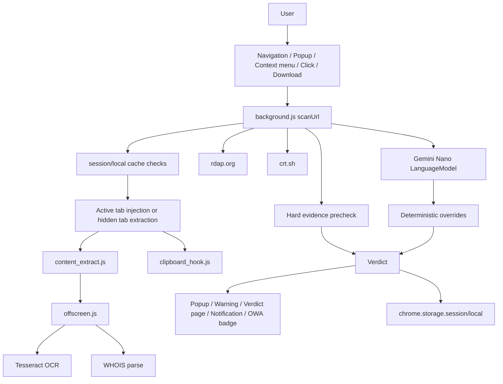

# Windshock Lens Development Spec

> Formerly ScamGuard AI. Renamed in v0.2.0 (2026-05-28). All product-level references below are Windshock Lens.

작성일: 2026-05-28 (Asia/Seoul)  
대상 버전: v0.1.31  
분석 기준: 코드/문서 정적 분석. 런타임 검증은 수행하지 않음.  
주요 근거: `manifest.json`, `background.js`, `click_guard.js`, `content_extract.js`, `offscreen.js`, `popup.js`, `warning.js`, `verdict.js`, `eval/eval_harness.py`

## 1. 제품 목적

Windshock Lens는 Chrome MV3 확장 프로그램으로, 사용자가 방문하거나 클릭하려는 웹 페이지가 피싱/스캠인지 Chrome 내장 Gemini Nano Prompt API와 결정론적 룰로 판단한다. 설계의 중심은 외부 LLM API를 쓰지 않는 온디바이스 추론, 명확한 위험 신호의 코드 기반 강제 판정, 사용자가 오탐을 해소할 수 있는 allowlist/reset 제어다.

주의: 제품 설명의 "Zero-Data"는 외부 LLM API로 브라우징 데이터를 보내지 않는다는 의미로 해석해야 한다. 현재 구현은 사용자가 연 페이지 또는 hidden scan tab을 통해 대상 페이지/서브리소스를 로드할 수 있고, WHOIS/RDAP/CT 조회와 OCR 대상 이미지 fetch 같은 일부 네트워크 메타데이터/리소스 요청도 수행한다.

## 2. 현재 범위

| 항목 | 현재 스펙 |
|---|---|
| 플랫폼 | Chrome Extension Manifest V3 |
| 최소 브라우저 | Chrome 138 이상 (`manifest.json#minimum_chrome_version`) |
| AI 런타임 | Chrome built-in `LanguageModel`, Gemini Nano, fallback 없음 (`background.js#ensureSession`, `background.js#checkAvailability`) |
| 추론 방식 | `temperature: 0`, `topK: 1`, JSON schema 강제 (`background.js#LanguageModel.create` 호출, `VERDICT_SCHEMA`) |
| 주요 입력 | URL, DOM/form/link/text, 클립보드/다운로드/위험 URI 행동 신호, OCR, WHOIS/RDAP/CT |
| 주요 출력 | `Verdict` JSON: `phishing_score`, `brand`, `phishing`, `suspicious_domain`, `reason` |
| 배포 방식 | 빌드 스텝 없음. `Load unpacked` 기반 |
| 활성 content script | 모든 http/https 페이지의 `click_guard.js` (`manifest.json#content_scripts`) |
| 보존 코드 | `owa_scan.js`, `owa_banner.css`는 존재하지만 manifest 주입은 비활성 |

## 3. 시스템 구성

| 컴포넌트 | 책임 |
|---|---|
| `manifest.json` | MV3 권한, service worker, popup, content script, web-accessible UI 리소스 선언 |
| `background.js` | 단일 스캔 진입점 `scanUrl()`, 모델 세션, 캐시, allowlist/denylist, 트리거 처리, 결과 dispatch |
| `click_guard.js` | 페이지 내 클릭 캡처, 위험 URI 즉시 차단, 다운로드/copy/social 버튼 클릭 전 페이지 스캔 |
| `content_extract.js` | DOM/form/link/image/text 및 행동 신호 직렬화 |
| `clipboard_hook.js` | MAIN world에서 clipboard write/execCommand 이벤트를 dataset으로 브리지 |
| `offscreen.js` | Tesseract OCR, WHOIS HTML 파싱, 정적 HTML 파싱, 런타임 아이콘 생성 |
| `popup.js` | 모델 상태 표시, 현재 탭 수동 스캔, reset UI, 상세 페이지 연결 |
| `warning.js` | 위험 verdict 발생 시 탭 가로채기 화면, close/rescan/allow 동작 |
| `verdict.js` | 최근/특정 verdict 상세 표시, allowlist 등록 |
| `eval/eval_harness.py` | Chrome CDP 기반 fixture/corpus 회귀 검증 |

## 4. 데이터 흐름



## 5. 런타임 인터페이스

### 5.1 Runtime messages

| Message | 입력 | 출력 | 비고 |
|---|---|---|---|
| `scan` | `{ url, source?, tabId?, anchorId?, bypassCache? }` | `Verdict` 또는 `{ error }` | 핵심 API. `background.js#onMessage` 의 `"scan"` 분기 |
| `availability` | `{}` | model status | 모델 가용성 조회 |
| `prepare-model` | `{}` | model status | 모델 다운로드/세션 생성 |
| `model-status` | `{}` | model status | polling용 |
| `diagnostics` | `{}` | model/OCR/Tesseract 상태 | `background.js#onMessage` 의 `"diagnostics"` 분기 |
| `allowlist` | `{ url }` | `{ ok, host }` | host 단위 영구 허용 |
| `resetHistoryForUrl` | `{ url }` | `{ ok, host, denyRemoved, sessionRemoved }` | host/URL 단위 기록 초기화 |
| `resetHistory` | `{}` | `{ ok, cleared }` | 전체 검사 기록 초기화 |
| `getVerdict` | `{ vid }` 또는 `{ url }` | `Verdict|null` | warning/verdict 화면 조회 |
| `debug-extract` | `{ url }` | 추출 결과 | 개발 디버그용 |

### 5.2 Offscreen messages

| Message | 책임 |
|---|---|
| `OCR_DIAGNOSTICS` | Tesseract 런타임/언어 파일 가용성 반환 |
| `OCR` | 이미지 URL/data URL OCR, 이미지당 200자/총 800자 제한 |
| `WHOIS_PARSE` | yesnic HTML에서 7개 WHOIS 필드 압축 |
| `PARSE_STATIC_HTML` | OWA 백그라운드 스캔용 정적 HTML 파싱 |
| `GENERATE_ICONS` | 액션/알림 아이콘 런타임 생성 |

### 5.3 Verdict schema

```json
{
  "phishing_score": 0,
  "brand": null,
  "phishing": false,
  "suspicious_domain": false,
  "reason": "string"
}
```

런타임에서 `url`, `ts`, `hard_evidence`, `llm_skipped`, `final_url` 등이 추가될 수 있다. 위험도 기준은 `score >= 7` 또는 `phishing === true`면 danger, `score >= 4`면 warn, 그 외 ok다.

## 6. 기능 요구사항

| ID | 요구사항 | 수용 기준 |
|---|---|---|
| FR-001 | 확장은 Chrome 138+ MV3에서 동작해야 한다. | `manifest_version=3`, `minimum_chrome_version=138` 유지 |
| FR-002 | Gemini Nano 미지원 환경에서는 fallback 없이 비활성/오류를 반환해야 한다. | `LanguageModel` 미존재 시 `model_unavailable`; 외부 LLM API 호출 없음 |
| FR-003 | 모든 스캔은 `scanUrl(url, source, meta)`로 수렴해야 한다. | 새 트리거 추가 시 `scanUrl` 우회 금지 |
| FR-004 | 동일 URL 동시 스캔은 single-flight로 합쳐야 한다. leader 와 다른 source 의 awaiter 도 자기 부수효과(navigation 탭 가로채기, owa 배너, contextMenu/action 알림)를 1회 보장해야 한다. | navigation/popup/click-guard 동시 호출 시 모델 prompt는 1회만 수행. `AWAITER_DISPATCH_SOURCES` 에 등록된 awaiter source 는 leader 와 다를 경우 자기 source 로 dispatchResult 한 번 더 발화 |
| FR-005 | 사용자가 직접 방문한 http/https 활성 탭은 navigation scan 대상이어야 한다. | hidden scan tab, inactive tab, 비 http(s)는 제외 |
| FR-006 | popup은 모델 상태, 진행 단계, 현재 페이지 verdict, 기록 초기화를 제공해야 한다. | 60초 timeout 이후 spinner가 무한 지속되지 않음 |
| FR-007 | 우클릭 링크 검사는 현재 페이지가 아니라 `info.linkUrl`을 검사해야 한다. | context menu `"scan-link"` 유지 |
| FR-008 | click guard는 위험 URI/data executable은 즉시 차단하고, 다운로드/copy/social 버튼은 페이지 스캔 후 진행 여부를 결정해야 한다. | danger verdict는 클릭 차단, warn은 사용자 확인, safe는 원 클릭 재실행 |
| FR-009 | 다운로드 시작 시 호스팅 페이지를 검사하고 danger면 다운로드를 cancel/erase해야 한다. | 안전 다운로드는 조용히 resume |
| FR-010 | 페이지 추출은 활성 탭 주입, OWA 정적 fetch, hidden tab 동적 렌더링 경로를 구분해야 한다. | `navigation`/`popup`/`download-silent-ok`는 가능하면 활성 탭 주입, `owa`는 hidden tab 금지 |
| FR-011 | hidden tab 스캔은 `#__pg_scan=1` 마커로 click_guard cascade를 방지해야 한다. | marker URL은 최종 추출 URL에서 제거 |
| FR-012 | OCR은 로컬 Tesseract 파일만 사용해야 한다. | CDN 로드 금지, `lib/*` 파일 진단 가능 |
| FR-013 | WHOIS/RDAP/CT 소유권 정보는 LLM prompt와 deterministic override 모두에 제공되어야 한다. | yesnic/RDAP/CT 결과는 한 줄 문자열로 결합 |
| FR-014 | hard evidence는 LLM 호출 전 danger verdict를 만들 수 있어야 한다. | shell clipboard, auto-download, hard dangerous URI, kit marker + credential form은 `llm_skipped=true` 가능 |
| FR-015 | LLM 출력은 schema로 강제되고 JSON 파싱 실패 시 오류를 반환해야 한다. | `VERDICT_SCHEMA` 변경 시 UI와 eval도 동기화 |
| FR-016 | 결정론적 override는 LLM보다 우선해야 한다. | O0/O1/O1-whois/O2/O3/O4/O7/D1/O5/O6의 우선순위와 safe/danger 충돌 규칙 유지 |
| FR-017 | danger verdict는 사용자 의도가 있는 활성 탭에서 `warning.html`로 가로채야 한다. | `navigation`/`popup`/`action`/`download-silent-ok` danger는 `tabId`가 있을 때 warning URL로 이동. 현재 `action` source는 예약값이며 기본 popup 구성에서는 직접 발생하지 않음 |
| FR-018 | popup source는 OS 알림을 만들지 않아야 한다. | popup UI가 자체 결과 표시, blur-close 방지 |
| FR-019 | host allowlist는 `chrome.storage.local.allowlistHosts`에 평문 host로 저장되어야 한다. | allowlist hit는 scan short-circuit |
| FR-020 | phishing denylist는 host sha256으로 저장되어야 한다. | danger score >= 7 확정 시 host hash 기록, private IP 제외 |
| FR-021 | 세션 캐시는 URL hash 기반 verdict, lastVerdict, RDAP/CT, safeHosts를 포함해야 한다. | reset 동작별 삭제 범위가 문서화된 대로 유지 |
| FR-022 | i18n은 English default, Korean toggle을 지원해야 한다. | `chrome.storage.local.lang`으로 유지 |
| FR-023 | OWA 자동 스캔은 현재 manifest에서는 비활성으로 유지한다. | 재활성 시 민감 액션 링크 자동 fetch 금지 |
| FR-024 | 회귀 검증은 fixture와 corpus 경로를 모두 지원해야 한다. | `python3 eval/eval_harness.py --diagnostics --fixture` 경로 유지 |
| FR-025 | 내부 도메인(`INTERNAL_DOMAINS` 또는 RFC1918/loopback/link-local/IPv6 ULA) 은 hidden tab/extract/OCR/WHOIS/LM/hardEvidencePrecheck 전부 skip 한다. SPR-001 의 α 채택 — 내부 도메인 무조건 신뢰. | `scanUrl` 은 비-loopback URL의 allowlist/cache/safeHosts/denylist shortcut 이후, 페이지 추출 전 `internalDomain`이면 즉시 safe verdict 반환. loopback URL은 `bypassLookup=true`라 캐시/allowlist도 우회하고 곧바로 internal safe 경로로 감. 정책 변경 시 fixture localhost-* 와 함께 갱신 |
| FR-026 | LM 의 brand 출력은 케이싱·suffix 변동(`"Claude"` / `"deepseek ai"` / `"Microsoft Corporation"` 등) 에도 OFFICIAL_DOMAINS 매칭이 안정적이어야 한다. | `lookupOfficialDomains(brand)` 가 `toLowerCase().trim()` + `\s+ai$` suffix strip + 첫 단어 fallback 의 다단 lookup 수행. `OFFICIAL_DOMAINS_LC` 가 모듈 로드 시 빌드됨 |

## 7. 비기능 요구사항

| ID | 요구사항 | 수용 기준 |
|---|---|---|
| NFR-001 | 외부 LLM/API로 페이지 본문, URL, OCR 텍스트를 전송하지 않는다. | 코드에 OpenAI/remote LLM 호출 없음 |
| NFR-002 | 스캔 중 사용자 체감 방해를 줄인다. | 내부 도메인은 hidden tab 없이 short-circuit, popup은 단계 표시 |
| NFR-003 | 단일 모델 세션 직렬화 병목을 완화한다. | in-flight map과 session cache 유지 |
| NFR-004 | 알림 실패는 verdict 생성 실패로 전파되지 않는다. | `dispatchResult` 가 `notify()` 를 try/catch 로 래핑. SPOF T-ALL-DOWN은 보조 fetch 실패에도 verdict가 반환되는지 확인한다. notification 실패 격리는 danger verdict에서 `notify()` reject를 강제로 만들 때 별도 확인한다 |
| NFR-005 | 권한 사용은 문서화되어야 한다. | `<all_urls>`, downloads, history/bookmarks/topSites의 목적이 변경 시 검토됨 |
| NFR-006 | 모델 비결정성은 코드 룰과 fixture로 관리한다. | 룰 변경 시 fixture 추가 또는 갱신 |
| NFR-007 | 개인정보/민감값은 저장하지 않는다. | clipboard payload는 검사 입력으로만 사용, 장기 저장 금지. 단 verdict reason에 일부 payload가 들어갈 수 있으므로 캡 유지 |

## 8. 판정 룰 카탈로그

| Rule | 유형 | 조건 | 결과 |
|---|---|---|---|
| H1/O2 | danger | clipboard write에 shell payload | score 10 |
| H2/O3 | danger | 스캔 중 auto-download | score >= 9 |
| H3/O4 | danger | hard dangerous URI | score >= 9 |
| H4/O7 | danger | phishing kit marker + credential-like form | score >= 9 |
| O0 | danger | free-hosting 원본이 정식 도메인으로 redirect | score >= 8 |
| O1-whois | safe | brand token이 `Registrant:` 또는 `IssuerOrg:` 소유권 증거와 매칭. yesnic `Domain Name`/`Name Server`/`Contact` 세그먼트는 제외. **공유 호스팅(`FREE_HOSTING_RE` 매칭)은 진입 자체 skip** — platform 운영사(Microsoft/Google/Amazon 등)가 Registrant 로 비치지만 그 안의 테넌트 콘텐츠 소유권을 증명 못 함. 이 가드 없이는 cloud-platform brand 사칭이 silent FN 으로 통과 (예: Microsoft 사칭 페이지가 `*.azurewebsites.net` 에서 SAFE 처리) | score <= 3, 단 후속 danger 룰은 계속 적용. free-hosting 시 미발화 → O1 brand-mismatch 정상 진입 |
| O1 | danger/warn/safe | brand와 official domain mismatch/match | evidence 강도에 따라 score 조정 |
| D1 | danger | persistent denylist host hash hit | score >= 8 |
| O5 | safe | 사용자 bookmark/history/topSites 신뢰 도메인 | score <= 3, danger 없을 때만 |
| O6 | safe | 국내 인기 도메인 | score <= 3, danger 없을 때만 |

## 9. 저장소와 상태

| 저장 위치 | 키 | 내용 |
|---|---|---|
| `chrome.storage.session` | `v:<sha256(url)>` | URL verdict cache |
| `chrome.storage.session` | `verdict:<sha256(url)>` | warning page용 verdict |
| `chrome.storage.session` | `lastVerdict` | verdict 상세 fallback |
| `chrome.storage.session` | `rdap:<domain>`, `cert:<host>` | 소유권 조회 캐시 |
| `chrome.storage.session` | `safeHosts` | exact-host 세션 trust, 6시간 TTL |
| `chrome.storage.local` | `phishingDenylist` | host sha256 배열 |
| `chrome.storage.local` | `allowlistHosts` | 사용자 허용 host 배열 |
| `chrome.storage.local` | `lang` | `en` 또는 `ko` |
| `chrome.storage.local` | `notifIcons` | 런타임 생성 알림 아이콘 data URL |

## 10. 개발 워크플로우

1. 기능 변경 전 이 문서에 FR/NFR/IF/SEC/TEST ID를 추가하거나 갱신한다.
2. 구현은 기존 경계에 맞춰 진행한다: 스캔 플로우는 `background.js`, 추출은 `content_extract.js`, OCR/정적 파싱은 `offscreen.js`, UI는 각 페이지 JS.
3. 출력 schema 변경 시 `VERDICT_SCHEMA`, `popup.js`, `verdict.js`, fixture 기대값을 함께 갱신한다.
4. 룰 변경 시 최소 하나의 fixture 또는 regression case를 추가한다.
5. 모델 prompt 변경 시 `background.js`의 `SYS`와 보존 문서/legacy prompt 동기화 여부를 확인한다.
6. 검증 결과는 PR/커밋 설명에 fixture pass/fail과 미검증 사유를 남긴다.

## 11. 테스트 매트릭스

| TEST ID | 명령/방법 | 검증 대상 |
|---|---|---|
| TEST-001 | `python3 eval/eval_harness.py --diagnostics` | 모델/OCR/Tesseract 진단 |
| TEST-002 | `python3 eval/eval_harness.py --fixture` | fixture manifest pass/fail |
| TEST-003 | `python3 eval/eval_harness.py --max 20` | corpus smoke scan |
| TEST-004 | popup에서 현재 페이지 검사 | popup status, 단계 표시, timeout, 상세 링크 |
| TEST-005 | 위험 URL 직접 이동 | navigation scan과 warning intercept |
| TEST-006 | 위험 URI/copy/download 버튼 클릭 | click guard 차단/확인 UX |
| TEST-007 | 파일 다운로드 시작 | pause, scan, cancel/erase 또는 resume |
| TEST-008 | warning 페이지 rescan/allow/back | reset 범위, allowlist short-circuit, closeTab |
| TEST-009 | 언어 toggle | popup/warning/verdict/notification i18n |
| TEST-010 | 동일 URL 동시 trigger | single-flight와 중복 알림 방지 |
| TEST-011 | popup 콘솔에서 `eval/run_regression.js` 인젝션 → `fixture_manifest.json` 전체 케이스 일괄 검증 | 회귀 검증, PASS/FAIL 보고. 현재 manifest는 15 케이스이며, 새 케이스 추가는 manifest 만 수정 |
| TEST-012 | popup 콘솔에서 `eval/run_spof.js` 인젝션 → `__spof_runAll()` 또는 `__spof_TNX/TIP/TALLDOWN/TSLOW` 개별 | SPOF 시나리오 (DNS 실패 / IP-only / 모든 fetch 차단 / 느린 로딩) — 외부 의존성 실패 시 verdict 손실 없음 검증 |
| TEST-013 | SW 콘솔에서 `eval/spof_sw_helpers.js` 인젝션 → `__spof.blockAllFetch()` 후 popup `__spof_TALLDOWN()` | 보조 fetch 실패 상황에서 scan verdict가 손실되지 않는지 확인. 끝나고 `__spof.restore()` 로 원복. notification reject 격리는 별도 강제 실패 테스트가 필요 |

## 12. 현재 정리 필요 항목

| Gap ID | 내용 | 권장 결정 |
|---|---|---|
| GAP-001 | `README.md`는 OWA Enterprise Support를 기능으로 설명하지만, 현 manifest는 OWA content script를 주입하지 않는다. | public README에 "현재 비활성" 상태를 반영하거나 manifest 재활성화 여부 결정 |
| GAP-002 | (resolved 2026-05-28) α 채택: 내부 도메인은 어떤 위험 신호라도 무조건 신뢰. `fixture_manifest.json` 의 localhost-danger/hard-evidence 기대값을 `expectedPhishing=false, maxScore=0` 으로 갱신. FR-025 추가. SPR-001 closed. | (해결됨) — 정책 재변경 필요 시 FR-025 + 두 fixture 부터 갱신 |
| GAP-003 | "Zero-Data" 문구가 WHOIS/RDAP/CT/이미지 fetch와 혼동될 수 있다. | "외부 LLM 전송 없음"과 "소유권/리소스 조회는 발생"을 제품 문구에 분리 |
| GAP-004 | `eval/eval_harness.py`는 기본적으로 manifest version을 bump한다. | CI/로컬 검증에서 `--no-bump` 사용 기준 명시 |
| GAP-005 | `<all_urls>`, `history`, `bookmarks`, `topSites`, `downloads` 권한은 강하다. | 사내 배포/스토어 배포 전 권한 정당성 문서와 opt-in 정책 검토 |

## 13. 변경 요청 템플릿

```markdown
## Spec Change
- Requirement ID:
- User story:
- Current behavior:
- Desired behavior:
- Security/privacy impact:
- Storage/schema impact:
- UI/i18n impact:
- Test plan:
- Rollback plan:

## Regression Checklist
- [ ] `eval/run_regression.js` 전체 PASS 결과 (실패한 fixture 사유 동봉)
- [ ] 탐지 룰/override 변경이면 fixture 신규 추가 또는 갱신
- [ ] SPR/GAP 신규 도출되면 `security-product-requirements.md` 또는 본 문서 GAP 표에 등록
- [ ] LM 출력 필드(brand 등) 또는 schema 변경이면 popup/verdict/warning UI 모두 영향 점검
- [ ] dispatch/finalize 경로 변경이면 SPOF (`eval/run_spof.js`) 회귀
```
