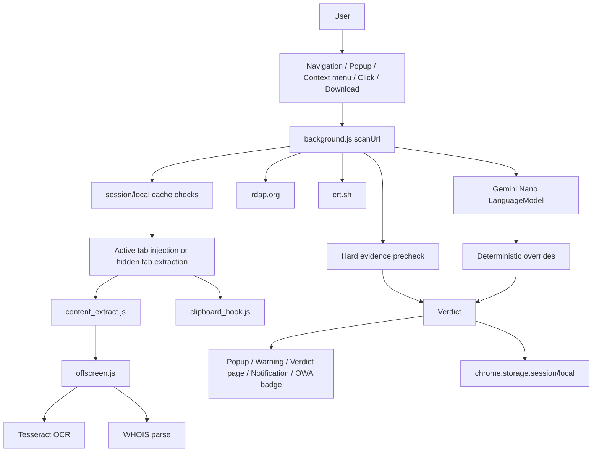

# Windshock Lens Development Spec

> Formerly ScamGuard AI. Renamed in v0.2.0 (2026-05-28). All product-level references below are Windshock Lens.

작성일: 2026-05-28 (Asia/Seoul)  
대상 버전: v0.1.31  
분석 기준: 코드/문서 정적 분석. 런타임 검증은 수행하지 않음.  
주요 근거: `manifest.json`, `background.js`, `click_guard.js`, `content_extract.js`, `offscreen.js`, `popup.js`, `warning.js`, `verdict.js`, `eval/eval_harness.py`

## 1. 제품 목적

Windshock Lens는 Chrome MV3 확장 프로그램으로, 사용자가 방문하거나 클릭하려는 웹 페이지가 피싱/스캠인지 Chrome 내장 Gemini Nano Prompt API와 결정론적 룰로 판단한다. 설계의 중심은 외부 LLM API를 쓰지 않는 온디바이스 추론, 명확한 위험 신호의 코드 기반 강제 판정, 사용자가 오탐을 해소할 수 있는 allowlist/reset 제어다.

주의: 제품 설명의 "Zero-Data"는 외부 LLM API로 브라우징 데이터를 보내지 않는다는 의미로 해석해야 한다. 현재 구현은 사용자가 연 페이지 또는 hidden scan tab을 통해 대상 페이지/서브리소스를 로드할 수 있고, WHOIS/RDAP/CT 조회와 OCR 대상 이미지 fetch 같은 일부 네트워크 메타데이터/리소스 요청도 수행한다.

## 2. 현재 범위

| 항목 | 현재 스펙 |
|---|---|
| 플랫폼 | Chrome Extension Manifest V3 |
| 최소 브라우저 | Chrome 138 이상 (`manifest.json#minimum_chrome_version`) |
| AI 런타임 | Chrome built-in `LanguageModel`, Gemini Nano, fallback 없음 (`background.js#ensureSession`, `background.js#checkAvailability`) |
| 추론 방식 | `temperature: 0`, `topK: 1`, JSON schema 강제 (`background.js#LanguageModel.create` 호출, `VERDICT_SCHEMA`) |
| 주요 입력 | URL, DOM/form/link/text, 클립보드/다운로드/위험 URI 행동 신호, OCR, WHOIS/RDAP/CT |
| 주요 출력 | `Verdict` JSON: `phishing_score`, `brand`, `phishing`, `suspicious_domain`, `reason` |
| 배포 방식 | 빌드 스텝 없음. `Load unpacked` 기반 |
| 활성 content script | 모든 http/https 페이지의 `click_guard.js` (`manifest.json#content_scripts`) |
| OWA 코드 | v0.2.x 에서 삭제 (Chrome Web Store reviewer 의 Personal Communications 우려 회피). git history 에 보존 |

## 3. 시스템 구성

| 컴포넌트 | 책임 |
|---|---|
| `manifest.json` | MV3 권한, service worker, popup, content script, web-accessible UI 리소스 선언 |
| `background.js` | 단일 스캔 진입점 `scanUrl()`, 모델 세션, 캐시, allowlist/denylist, 트리거 처리, 결과 dispatch |
| `click_guard.js` | 페이지 내 클릭 캡처, 위험 URI 즉시 차단, 다운로드/copy/social 버튼 클릭 전 페이지 스캔 |
| `content_extract.js` | DOM/form/link/image/text 및 행동 신호 직렬화 |
| `clipboard_hook.js` | MAIN world에서 clipboard write/execCommand 이벤트를 dataset으로 브리지 |
| `offscreen.js` | Tesseract OCR, WHOIS HTML 파싱, 정적 HTML 파싱, 런타임 아이콘 생성 |
| `popup.js` | 모델 상태 표시, 현재 탭 수동 스캔, reset UI, 상세 페이지 연결 |
| `warning.js` | 위험 verdict 발생 시 탭 가로채기 화면, close/rescan/allow 동작 |
| `verdict.js` | 최근/특정 verdict 상세 표시, allowlist 등록 |
| `compat-check.html` / `compat-check.js` | Built-in AI 호환성 진단 페이지 — `LanguageModel.availability()` + UA-CH / hardwareConcurrency / deviceMemory / Save Data / WebGPU adapter / storage.estimate 프로브. 외부 fetch 없음. popup 의 unavailable/error 상태에서 `chrome.runtime.getURL` 로 열림. `docs/compat-check.*` 에 동일 사본이 mirror 되어 GitHub Pages 에서도 서빙 |
| `eval/eval_harness.py` | Chrome CDP 기반 fixture/corpus 회귀 검증 |

## 4. 데이터 흐름


```mermaid
flowchart TD
  User[User] --> Trigger[Navigation / Popup / Context menu / Click / Download]
  Trigger --> SW[background.js scanUrl]
  SW --> Cache[session/local cache checks]
  Cache --> Extract[Active tab injection or hidden tab extraction]
  Extract --> Content[content_extract.js]
  Extract --> Hook[clipboard_hook.js]
  Content --> Offscreen[offscreen.js]
  Offscreen --> OCR[Tesseract OCR]
  Offscreen --> Whois[WHOIS parse]
  SW --> RDAP[rdap.org]
  SW --> CT[crt.sh]
  SW --> Precheck[Hard evidence precheck]
  Precheck --> Verdict[Verdict]
  SW --> LLM[Gemini Nano LanguageModel]
  LLM --> Overrides[Deterministic overrides]
  Overrides --> Verdict
  Verdict --> UI[Popup / Warning / Verdict page / Notification / OWA badge]
  Verdict --> Storage[chrome.storage.session/local]
```

## 5. 런타임 인터페이스

### 5.1 Runtime messages

| Message | 입력 | 출력 | 비고 |
|---|---|---|---|
| `scan` | `{ url, source?, tabId?, anchorId?, bypassCache? }` | `Verdict` 또는 `{ error }` | 핵심 API. `background.js#onMessage` 의 `"scan"` 분기 |
| `availability` | `{}` | model status | 모델 가용성 조회 |
| `prepare-model` | `{}` | model status | 모델 다운로드/세션 생성 |
| `model-status` | `{}` | model status | polling용 |
| `diagnostics` | `{}` | model/OCR/Tesseract 상태 | `background.js#onMessage` 의 `"diagnostics"` 분기 |
| `allowlist` | `{ url }` | `{ ok, host }` | host 단위 영구 허용 |
| `resetHistoryForUrl` | `{ url }` | `{ ok, host, denyRemoved, sessionRemoved }` | host/URL 단위 기록 초기화 |
| `resetHistory` | `{}` | `{ ok, cleared }` | 전체 검사 기록 초기화 |
| `getVerdict` | `{ vid }` 또는 `{ url }` | `Verdict|null` | warning/verdict 화면 조회 |
| `clickGuardWarnApprovalStatus` | `{ url }` | `{ approved, host?, expiresAt? }` | click guard 전용 exact-URL warn 재확인 생략 상태 조회 |
| `rememberClickGuardWarnApproval` | `{ url, score? }` | `{ ok, host?, expiresAt? }` | click guard warn 확인을 세션에 기록. allowlist 아님 |
| `debug-extract` | `{ url }` | 추출 결과 | 개발 디버그용 |

### 5.2 Offscreen messages

| Message | 책임 |
|---|---|
| `OCR_DIAGNOSTICS` | Tesseract 런타임/언어 파일 가용성 반환 |
| `OCR` | 이미지 URL/data URL OCR, 이미지당 200자/총 800자 제한 |
| `WHOIS_PARSE` | yesnic HTML에서 7개 WHOIS 필드 압축 |
| `PARSE_STATIC_HTML` | OWA 백그라운드 스캔용 정적 HTML 파싱 |
| `GENERATE_ICONS` | (legacy, 미사용) 과거 액션/알림 아이콘 런타임 생성용. v0.2.2 부터 SW 가 호출하지 않음 — manifest 의 `default_icon` 정적 PNG (`icons/action-*.png`) 와 `notify()` 의 `chrome.runtime.getURL("icons/notif-{severity}-128.png")` 직접 참조로 대체. offscreen 핸들러는 호환을 위해 남겨둠 |

### 5.3 Verdict schema

```json
{
  "phishing_score": 0,
  "brand": null,
  "phishing": false,
  "suspicious_domain": false,
  "reason": "string"
}
```

런타임에서 `url`, `ts`, `hard_evidence`, `llm_skipped`, `final_url` 등이 추가될 수 있다. 위험도 기준은 `score >= 7` 또는 `phishing === true`면 danger, `score >= 4`면 warn, 그 외 ok다.

## 6. 기능 요구사항

| ID | 요구사항 | 수용 기준 |
|---|---|---|
| FR-001 | 확장은 Chrome 138+ MV3에서 동작해야 한다. | `manifest_version=3`, `minimum_chrome_version=138` 유지 |
| FR-002 | Gemini Nano 미지원 환경에서는 fallback 없이 비활성/오류를 반환해야 한다. | `LanguageModel` 미존재 시 `model_unavailable`; 외부 LLM API 호출 없음 |
| FR-003 | 모든 스캔은 `scanUrl(url, source, meta)`로 수렴해야 한다. | 새 트리거 추가 시 `scanUrl` 우회 금지 |
| FR-004 | 동일 URL 동시 스캔은 single-flight로 합쳐야 한다. leader 와 다른 source 의 awaiter 도 자기 부수효과(navigation 탭 가로채기, owa 배너, contextMenu/action 알림)를 1회 보장해야 한다. | navigation/popup/click-guard 동시 호출 시 모델 prompt는 1회만 수행. `AWAITER_DISPATCH_SOURCES` 에 등록된 awaiter source 는 leader 와 다를 경우 자기 source 로 dispatchResult 한 번 더 발화 |
| FR-005 | 사용자가 직접 방문한 http/https 활성 탭은 navigation scan 대상이어야 한다. | hidden scan tab, inactive tab, 비 http(s)는 제외 |
| FR-006 | popup은 모델 상태, 진행 단계, 현재 페이지 verdict, 기록 초기화를 제공해야 한다. | 60초 timeout 이후 spinner가 무한 지속되지 않음 |
| FR-007 | 우클릭 링크 검사는 현재 페이지가 아니라 `info.linkUrl`을 검사해야 한다. | context menu `"scan-link"` 유지 |
| FR-008 | click guard는 위험 URI/data executable은 즉시 차단하고, 다운로드/copy/social 버튼은 페이지 스캔 후 진행 여부를 결정해야 한다. | danger verdict는 클릭 차단, warn은 사용자 확인 후 같은 exact URL 에 대해 이번 브라우저 세션 동안 재확인 생략, safe는 원 클릭 재실행. warn 승인은 click guard 전용 `clickGuardWarnApprovals` 세션 키에 URL hash 로 저장하며 host allowlist / safeHosts 로 승격하지 않는다 |
| FR-009 | 다운로드 시작 시 호스팅 페이지를 검사하고 danger면 다운로드를 cancel/erase해야 한다. | 안전 다운로드는 조용히 resume |
| FR-010 | 페이지 추출은 활성 탭 주입, OWA 정적 fetch, hidden tab 동적 렌더링 경로를 구분해야 한다. | `navigation`/`popup`/`download-silent-ok`는 가능하면 활성 탭 주입, `owa`는 hidden tab 금지 |
| FR-011 | hidden tab 스캔은 `#__pg_scan=1` 마커로 click_guard cascade를 방지해야 한다. | marker URL은 최종 추출 URL에서 제거 |
| FR-012 | OCR은 로컬 Tesseract 파일만 사용해야 한다. | CDN 로드 금지, `lib/*` 파일 진단 가능 |
| FR-013 | WHOIS/RDAP/CT 소유권 정보는 LLM prompt와 deterministic override 모두에 제공되어야 한다. | yesnic/RDAP/CT 결과는 한 줄 문자열로 결합 |
| FR-014 | hard evidence는 LLM 호출 전 danger verdict를 만들 수 있어야 한다. | shell clipboard, auto-download, hard dangerous URI, kit marker + credential form은 `llm_skipped=true` 가능 |
| FR-015 | LLM 출력은 schema로 강제되고 JSON 파싱 실패 시 오류를 반환해야 한다. | `VERDICT_SCHEMA` 변경 시 UI와 eval도 동기화 |
| FR-016 | 결정론적 override는 LLM보다 우선해야 한다. | O0/O1/O1-whois/O1-whois-transitive/O1-infra-corroboration/O2/O3/O4/O7/D1/O5/O6/O8-saas/O9-first-party-install/O10-model-consistency/O11-third-party-form-provider/O12-third-party-provider-page의 우선순위와 safe/danger 충돌 규칙 유지 |
| FR-017 | danger verdict는 사용자 의도가 있는 활성 탭에서 `warning.html`로 가로채야 한다. | `navigation`/`popup`/`action`/`download-silent-ok` danger는 `tabId`가 있을 때 warning URL로 이동. 현재 `action` source는 예약값이며 기본 popup 구성에서는 직접 발생하지 않음 |
| FR-018 | popup source는 OS 알림을 만들지 않아야 한다. | popup UI가 자체 결과 표시, blur-close 방지 |
| FR-019 | host allowlist는 `chrome.storage.local.allowlistHosts`에 평문 host로 저장되어야 한다. | allowlist hit는 scan short-circuit |
| FR-020 | phishing denylist는 host sha256으로 저장되어야 한다. | danger score >= 7 확정 시 host hash 기록, private IP 제외. **회귀 모드(`meta.bypassUserTrust`)는 denylist write 제외 — FR-033 self-poisoning 차단** |
| FR-021 | 세션 캐시는 URL hash 기반 verdict, lastVerdict, RDAP/CT, safeHosts를 포함해야 한다. | reset 동작별 삭제 범위가 문서화된 대로 유지 |
| FR-022 | i18n은 English default, Korean toggle을 지원해야 한다. | `chrome.storage.local.lang`으로 유지 |
| FR-023 | OWA 자동 스캔은 현재 manifest에서는 비활성으로 유지한다. | 재활성 시 민감 액션 링크 자동 fetch 금지 |
| FR-024 | 회귀 검증은 fixture와 corpus 경로를 모두 지원해야 한다. | `python3 eval/eval_harness.py --diagnostics --fixture` 경로 유지 |
| FR-025 | 내부 도메인(`INTERNAL_DOMAINS` 또는 RFC1918/loopback/link-local/IPv6 ULA) 은 hidden tab/extract/OCR/WHOIS/LM/hardEvidencePrecheck 전부 skip 한다. SPR-001 의 α 채택 — 내부 도메인 무조건 신뢰. | `scanUrl` 은 비-loopback URL의 allowlist/cache/safeHosts/denylist shortcut 이후, 페이지 추출 전 `internalDomain`이면 즉시 safe verdict 반환. loopback URL은 `bypassLookup=true`라 캐시/allowlist도 우회하고 곧바로 internal safe 경로로 감. 정책 변경 시 fixture localhost-* 와 함께 갱신 |
| FR-026 | LM 의 brand 출력은 케이싱·suffix 변동(`"Claude"` / `"deepseek ai"` / `"Microsoft Corporation"` 등) **및 한글 유니코드 정규화 변동(NFC/NFD)** 에도 OFFICIAL_DOMAINS 매칭이 안정적이어야 한다. | `lookupOfficialDomains(brand)` 가 `normalize("NFC")` + `toLowerCase().trim()` + `\s+ai$` suffix strip + 첫 단어 fallback 의 다단 lookup 수행. `OFFICIAL_DOMAINS_LC` 키도 NFC 로 빌드. `normalizeBrand()` 가 verdict.brand 를 NFC canonical 로 고정해 downstream(O1-whois 토큰 비교·표시)도 일관. **근거: Gemini Nano 가 한글 브랜드(예: `"OK캐쉬백"`)를 NFD(분해형)로 출력하면 NFC 키 Map 과 직접 매칭이 silent FN 으로 실패 — O1-safe 미발화로 정식 도메인이 phishing 판정되던 회귀를 차단.** |
| FR-027 | popup 이 `availability=unavailable` 또는 model setup error 상태이면 사용자가 원인을 자가진단할 수 있는 통로를 제공해야 한다. | popup status row 아래 "왜 모델이 안 깔리는지" 링크 노출 → `chrome.runtime.getURL("compat-check.html")` 새 탭 오픈. 진단 페이지는 외부 네트워크 호출 없이 deterministic (Chrome 138+/OS/cores/RAM/Save Data) + heuristic (WebGPU integrated GPU/storage quota) 프로브 후 결과 카드 + "다음 단계" 안내(`chrome://on-device-internals`, `chrome://policy` 등)를 표시. `downloadable` 상태일 때는 `LanguageModel.create({monitor})` 다운로드 트리거 버튼 제공. CSP 상 inline script 금지를 지키기 위해 로직은 `compat-check.js` 외부 파일에 둔다 |
| FR-028 | 현재 탭에 적용되는 UI 부수효과는 스캔 대상 host와 현재 탭 host가 일치할 때만 발화해야 한다. | 비동기 `navigation` scan 결과가 늦게 돌아와 현재 탭이 다른 host로 이동한 경우 `warning.html` intercept / OS 알림 / inline UI는 생략한다. 단 verdict cache, `lastVerdict`, denylist 기록은 정상적으로 남긴다 |
| FR-029 | 공유 SaaS / 파일 호스팅 플랫폼의 소유권 신뢰와 콘텐츠 신뢰를 분리해야 한다. | `sharepoint.com`, OneDrive, Dropbox, Google Drive 같은 정상 SaaS 플랫폼의 WHOIS/RDAP/CT 소유권은 "플랫폼 운영사"만 증명한다. 이를 근거로 테넌트 콘텐츠나 문서 내부 링크를 safe 확정하지 않는다. `*.sharepoint.com` 전체 allowlist 또는 `OFFICIAL_DOMAINS` 전역 safe 등록 금지. **구현: `SHARED_SAAS_RE` + `applyOverrides` 의 `O8-saas` 룰. hard evidence(O2/O3/O4/O7/D1)·외부 redirect(O0)·danger override 가 전혀 없을 때만 LLM 의 약신호 단독 격상을 score ≤ 3 으로 cap. OFFICIAL_DOMAINS 전역 등록(브랜드 소유권 주장)이 아니라 hard-evidence 부재 시의 점수 cap 이며, DOMAIN_TRUST_RULES 에 넣지 않아 세션/영구 trust 로 굳지 않고 매 스캔 재평가(FR-030). brand 가 SaaS 가 아닌 타 브랜드 사칭이고 credential form 등 hard evidence 가 있으면 O1/O7 danger 가 cap 위에서 우선.** |
| FR-030 | 조직 SaaS 테넌트 신뢰는 AI 추론이 아니라 정책 입력이어야 한다. | `skpcorp-my.sharepoint.com` 같은 exact tenant host가 조직 소유인지 AI/WHOIS로 추정하지 않는다. 사내 배포에서 필요하면 관리자가 exact host allowlist/policy로 제공한다. 이 정책은 검사 skip이 아니라 false-positive 완화용이며, O2/O3/O4/O7/D1 및 외부 피싱 redirect 증거는 항상 우선한다 |
| FR-031 | 정상 SaaS referral/query 파라미터는 단독 위험 근거가 될 수 없다. | Microsoft 365 app launcher 흐름의 `source=waffle` 같은 파라미터는 단독으로 phishing/warn/danger 점수를 올리지 않는다. 위험 평가는 테넌트 맥락, 문서 내용, credential re-auth lure, 외부 링크/redirect, hard evidence와 결합해서만 수행한다. **`O8-saas` 룰이 hard evidence 부재 시 SaaS 호스트의 약신호 점수를 cap 하므로, `source=waffle` 단독으로는 maxScore 를 넘지 못한다.** |
| FR-032 | `OFFICIAL_DOMAINS` 큐레이션 부담을 줄이기 위해 브랜드 sibling 도메인을 WHOIS Registrant 동일성으로 런타임 추론한다. 단, 양쪽 registrant 가 모두 노출 가능한 경우에 한해 동작 — anchor 가 GDPR redact 된 .com 등에는 적용 불가. 미적용 케이스는 anchor + sibling 을 OFFICIAL_DOMAINS 에 명시 등록한다. | `applyOverrides` 의 `O1-whois-transitive` 룰: 방문 호스트가 OFFICIAL_DOMAINS[brand] 에 직접 일치하지 않더라도, 호스트의 WHOIS Registrant 와 brand anchor 도메인의 RDAP Registrant 가 정규화 후 같으면 sibling 으로 인정해 점수 ≤ 3 으로 cap. 정규화는 lowercase + 법인 접미사 (Co./Ltd./Inc./LLC/GmbH/Corporation/(주)/주식회사) 제거 후 비교. free-hosting (FREE_HOSTING_RE) 호스트는 O1-whois 와 동일하게 skip. hard evidence (O2/O3/O4/O7/D1) 는 cap 위에서 우선 발화. **한계**: anchor 가 .com 이고 Verisign 가 Registrant 를 GDPR redact 한 경우 (대다수 retail .com) 이 룰은 silent no-op — 그 케이스는 OFFICIAL_DOMAINS 에 sibling 을 명시 추가해야 함. 첫 fixture: `ogog.kr/login?type=nosession` — 이 케이스는 anchor (okcashbag.com) RDAP 가 redact 되어 transitive 룰이 발화하지 않으므로 OFFICIAL_DOMAINS["OK캐쉬백"] 에 ogog.kr 명시 등록 + 브랜드 alias (영문/한글) 로 처리. transitive 룰은 미래의 .kr↔.kr / corporate-RDAP anchor 케이스에 자동 작동 |
| FR-033 | 회귀 테스트는 사용자 환경에 의존하는 신호 (O5 personal trust = bookmarks/history/topSites) 를 결정론적으로 우회할 수 있어야 한다. | `chrome.runtime.sendMessage({ type: "scan", url, bypassCache: true, bypassUserTrust: true })` 형태로 `bypassUserTrust` 플래그 송신. `onMessage` 의 `scan` 핸들러가 meta 로 전파, `scanUrl` → `applyOverrides` 로 같이 흐름. `applyOverrides` 의 `O5` 가드가 `meta.bypassUserTrust === true` 면 룰 전체 skip. allowlist / verdict cache / safeHosts / denylist 우회는 기존 `bypassCache: true` 가 담당하므로 두 플래그가 직교적이다. 정상 사용자 흐름은 두 플래그 모두 false 가 기본값이라 영향 없음. 회귀 콘솔 스니펫 (popup.html 탭에서 실행) 이 fixture_manifest.json 의 각 URL 에 두 플래그를 같이 보내 fixture 의 maxScore/expectedPhishing 검증. **추가로 `bypassUserTrust=true` 스캔은 `finalizeVerdict` 에서 denylist 에 쓰지 않는다 — 실패한 fixture 가 영구 denylist 에 등록되면 D1 이 이후 모든 스캔을 phishing 으로 고정해 회귀가 비멱등이 되는 self-poisoning 을 차단(FR-020 의 denylist write 는 정상 사용자 흐름에서만). 회귀 러너(`eval/run_regression.js`)는 시작 시 `resetHistory` 로 기존 오염을 1회 비운다.** |
| FR-034 | WHOIS 의 Name Server / Contact 이메일 도메인은 보조 ownership 신호로 활용하되, 단독으로 safe 처리하지 않는다. | `applyOverrides` 의 `O1-infra-corroboration` 룰. `extractInfraDomains(whois)` 가 `Name Server:` 호스트 + `Contact:`(및 기타) 이메일 도메인을 파싱. 다음 **네 조건을 모두** 충족할 때만 `phishing=false, score ≤ 3` cap: (1) 방문 호스트가 free/shared-hosting(`FREE_HOSTING_RE`) 아님 (2) hard evidence(danger override: O2/O3/O4/O7/D1/O0) 없음 (3) 페이지 title/visibleText/anchors 에 어떤 OFFICIAL_DOMAINS 브랜드 키(모회사 포함, 예 `SK플래닛`)가 명시됨 (4) NS/Contact 도메인이 그 브랜드 공식 도메인과 매칭(suffix). Registrant/IssuerOrg 매칭(O1-whois)은 그대로 유지하고 NS/Contact 는 이 별도 룰로 분리. 소유권 주장이 아니라 weak FP cap 이므로 `DOMAIN_TRUST_RULES` 제외(세션/영구 trust 안 굳힘, 매 스캔 재평가). danger 를 뒤집지 않음 — hard evidence 가 cap 위에서 우선. 예: `ogog.kr` 의 `ns1.skplanet.com`/`domain_skp@skplanet.com` + 페이지에 SK플래닛 명시 시 발화(단, ogog 자체는 OFFICIAL_DOMAINS 직접 등재로 O1-safe 가 먼저 처리). |
| FR-035 | 페이지 추출(`content_extract.js`)은 보안적으로 의미 있는 입력/제출 표면과 일반 UI 버튼을 구분하고, 컨트롤에 accessible label 을 포함해야 한다. | FORMS = form/input/textarea/select + credential·PII·submit 버튼(라벨이 `CREDENTIAL_CTRL_RE` 매칭). UI_CONTROLS = 라벨 있는 일반 버튼(네비/팔로우/카테고리 등) 최대 10, 저신호 슬라이스(priority 4.5, 토큰 압박 시 조기 drop). **라벨 없는 버튼 더미(`<button type="button">`)는 FORMS/UI 양쪽에서 제외** — LLM 입력 오염 방지. 각 컨트롤은 `aria-label`→`aria-labelledby`→`<label for>`→감싸는 `<label>`→자기 텍스트(button)→`title`/`placeholder` 순으로 label 추출해 `label="..."` 로 직렬화. prompt 섹션 분리(FORMS/UI_CONTROLS/TEXT)로 LLM 이 일반 UI 버튼을 credential form 으로 오해하지 않게 한다. 근거: 라벨 없는 버튼 더미가 정상 커뮤니티/리워드 페이지를 "버튼 많은 로그인/보상 페이지"로 보이게 해 FP 유발(ogog 회귀). |
| FR-036 | `OFFICIAL_DOMAINS`는 무한 allowlist가 아니라 고위험 브랜드 anchor로 제한하고, 일반 개발자 설치 명령 FP는 컨텍스트 룰로 완화해야 한다. | `O9-first-party-install`: LLM brand 토큰이 등록 도메인 SLD와 정확히 일치하고, `pre/code`에서 추출된 단순 `curl/wget https://... \| sh/bash/zsh` 명령의 URL도 같은 등록 도메인에 있으며, target path가 installer script 형태(`install.sh`, `setup`, `bootstrap` 등)이고 페이지가 설치/다운로드 + 개발자/OS 문맥일 때만 score ≤ 3 cap. free/shared hosting·known-brand mismatch·클립보드 shell payload·난독화(`eval/base64/tr/$()` 등)·captcha/verification lure·credential form·auto-download·dangerous URI·phishing-kit marker가 있으면 발화 금지. `DOMAIN_TRUST_RULES` 제외 — 세션 신뢰로 굳히지 않고 매 스캔 재평가. 예: `ollama.com/download`의 first-party `install.sh` 안내는 정상 설치 UX로 cap, `ollama-download.pages.dev` 또는 cross-origin/obfuscated/copy-to-clipboard 페이로드는 cap 금지. |
| FR-037 | LLM verdict의 boolean/reason/score 자기모순은 hard evidence가 없을 때 일관되게 보정해야 한다. | `O10-model-consistency`: `phishing=false`, `suspicious_domain=false`, reason 이 `legitimate/authentic/no phishing indicators/정상/피싱 징후 없음` 계열인데 score만 7 이상이고, credential form·clipboard shell·auto-download·dangerous URI·phishing-kit marker·obfuscated curl pipe가 모두 없으면 score ≤ 3 cap. danger override가 있으면 발화 금지. 예: `howcare.co.kr`에서 정상 사유 + score 8 모순을 safe로 보정. |
| FR-038 | cross-domain form POST는 피싱 근거가 아니라 context-expansion 신호로 분리해야 한다. | `content_extract.js` 는 현재 DOM form의 `crossDomainForms[]` 에 action origin/path, source/target registered domain, method, field names, hidden field names, query param names만 저장한다(값 저장 금지). hidden scan tab에서는 `webRequest.onBeforeRequest`로 main/sub-frame POST navigation의 필드명만 추가 기록해, 자동 POST 이후 최종 DOM만 남아도 원래 source→target 관계를 복구한다. `CROSS_DOMAIN_FORMS` prompt slice는 provider role을 별도 표시한다. `O11-third-party-form-provider`: 대상이 공인 third-party provider rule(endpoint/path + 파라미터 시그니처)에 맞고, source가 free/shared hosting이 아니며, URL/텍스트/폼 맥락이 인증·결제·OAuth 흐름과 자연스럽고, credential form·clipboard shell·auto-download·dangerous URI·phishing-kit marker·obfuscated curl pipe·직접 민감 입력 필드가 없을 때만 score ≤ 3 cap. 첫 rule은 KCB ok-name `safe.ok-name.co.kr/CommonSvl` + `cp_cd`/`mdl_tkn`/`tc`/`target_id` 중 2개 이상 매칭. provider 도메인 단독 allowlist 금지, `DOMAIN_TRUST_RULES` 제외. |

## 7. 비기능 요구사항

| ID | 요구사항 | 수용 기준 |
|---|---|---|
| NFR-001 | 외부 LLM/API로 페이지 본문, URL, OCR 텍스트를 전송하지 않는다. | 코드에 OpenAI/remote LLM 호출 없음 |
| NFR-002 | 스캔 중 사용자 체감 방해를 줄인다. | 내부 도메인은 hidden tab 없이 short-circuit, popup은 단계 표시 |
| NFR-003 | 단일 모델 세션 직렬화 병목을 완화한다. | in-flight map과 session cache 유지 |
| NFR-004 | 알림 실패는 verdict 생성 실패로 전파되지 않는다. | `dispatchResult` 가 `notify()` 를 try/catch 로 래핑. SPOF T-ALL-DOWN은 보조 fetch 실패에도 verdict가 반환되는지 확인한다. notification 실패 격리는 danger verdict에서 `notify()` reject를 강제로 만들 때 별도 확인한다 |
| NFR-005 | 권한 사용은 문서화되어야 한다. | `<all_urls>`, downloads, history/bookmarks/topSites의 목적이 변경 시 검토됨 |
| NFR-006 | 모델 비결정성은 코드 룰과 fixture로 관리한다. | 룰 변경 시 fixture 추가 또는 갱신 |
| NFR-007 | 개인정보/민감값은 저장하지 않는다. | clipboard payload는 검사 입력으로만 사용, 장기 저장 금지. 단 verdict reason에 일부 payload가 들어갈 수 있으므로 캡 유지 |
| NFR-008 | 사용자별 로컬 신뢰 신호(O5)는 조직 공통 정책을 대체하지 않는다. | history/bookmarks/topSites 유무에 따라 같은 SaaS URL의 verdict가 과도하게 갈리지 않도록, 공통 SaaS 패턴은 별도 룰/fixture로 관리한다. O5는 보조 false-positive 완화 신호로만 유지 |

## 8. 판정 룰 카탈로그

| Rule | 유형 | 조건 | 결과 |
|---|---|---|---|
| H1/O2 | danger | clipboard write에 shell payload | score 10 |
| H2/O3 | danger | 스캔 중 auto-download | score >= 9 |
| H3/O4 | danger | hard dangerous URI | score >= 9 |
| H4/O7 | danger | phishing kit marker + credential-like form | score >= 9 |
| O0 | danger | free-hosting 원본이 정식 도메인으로 redirect | score >= 8 |
| O1-whois | safe | brand token이 `Registrant:` 또는 `IssuerOrg:` 소유권 증거와 매칭. yesnic `Domain Name`/`Name Server`/`Contact` 세그먼트는 제외. **공유 호스팅(`FREE_HOSTING_RE` 매칭)은 진입 자체 skip** — platform 운영사(Microsoft/Google/Amazon 등)가 Registrant 로 비치지만 그 안의 테넌트 콘텐츠 소유권을 증명 못 함. 이 가드 없이는 cloud-platform brand 사칭이 silent FN 으로 통과 (예: Microsoft 사칭 페이지가 `*.azurewebsites.net` 에서 SAFE 처리) | score <= 3, 단 후속 danger 룰은 계속 적용. free-hosting 시 미발화 → O1 brand-mismatch 정상 진입 |
| O1-whois-transitive | safe | 방문 호스트 WHOIS Registrant == brand anchor 도메인 RDAP Registrant (정규화 후) | score <= 3 (FR-032). free-hosting skip, hard evidence 우선 |
| O1-infra-corroboration | safe | WHOIS Name Server/Contact 도메인이 페이지에 명시된 브랜드(모회사 포함) 공식 도메인과 매칭 + free-hosting 아님 + danger 없음 | score <= 3 (FR-034). 보조 증거 — 네 조건 전부 충족 시에만. DOMAIN_TRUST_RULES 제외 |
| O1 | danger/warn/safe | brand와 official domain mismatch/match | evidence 강도에 따라 score 조정 |
| D1 | danger | persistent denylist host hash hit | score >= 8 |
| O5 | safe | 사용자 bookmark/history/topSites 신뢰 도메인 | score <= 3, danger 없을 때만 (회귀 모드 `bypassUserTrust` 시 skip) |
| O6 | safe | 국내 인기 도메인 | score <= 3, danger 없을 때만 |
| O8-saas | safe | 멀티테넌트 SaaS 플랫폼(`SHARED_SAAS_RE`: sharepoint.com/onedrive.live.com/dropbox.com/box.com 등) | score <= 3, danger 없을 때만. 브랜드 소유권 미주장(DOMAIN_TRUST_RULES 제외 — 세션/영구 trust 안 굳힘, 매 스캔 재평가) |
| O9-first-party-install | safe | unknown brand token == registered-domain SLD + `pre/code` 내 simple same-registered-domain HTTPS `curl/wget ... \| sh/bash/zsh` installer command + 설치/다운로드 문맥 + hard evidence 없음 | score <= 3 (FR-036). `OFFICIAL_DOMAINS` 미등재 개발자 도구 FP 완화. DOMAIN_TRUST_RULES 제외 |
| O10-model-consistency | safe | `phishing=false` + `suspicious_domain=false` + benign reason + score >= 7 + hard evidence 없음 | score <= 3 (FR-037). 모델 자기모순 보정. DOMAIN_TRUST_RULES 제외 |
| O11-third-party-form-provider | safe | cross-domain form target이 공인 provider endpoint/parameter signature와 매칭 + 인증/결제/OAuth 맥락 + hard evidence/직접 민감 입력 없음 | score <= 3 (FR-038). cross-domain POST 단독 오탐 완화. DOMAIN_TRUST_RULES 제외 |
| O12-third-party-provider-page | safe | 현재 URL 자체가 공인 provider page + hard evidence/직접 민감 입력 없음 | score <= 3 (FR-038). source brand를 provider page 도메인 mismatch에 사용하지 않음. DOMAIN_TRUST_RULES 제외 |

## 8.1 공유 SaaS / 파일 호스팅 신뢰 모델

Microsoft 365 SharePoint/OneDrive, Dropbox, Google Drive 같은 파일 호스팅 SaaS는 합법 업무 흐름과 피싱 흐름이 같은 플랫폼 도메인을 공유한다. 따라서 Windshock Lens는 다음 신뢰 계층을 분리한다.

| 계층 | 예 | 의미 | 판정 정책 |
|---|---|---|---|
| 플랫폼 소유권 | `sharepoint.com` WHOIS/RDAP/CT가 Microsoft | 플랫폼 운영사 확인 | 콘텐츠 safe 확정 금지. O1-whois/O1-safe의 전역 safe 근거로 쓰지 않음 |
| 테넌트 식별 | `skpcorp-my.sharepoint.com` | 조직 테넌트일 수 있는 exact host | 공개 버전은 자동 추정 금지. 사내 배포는 관리자 정책으로 exact host만 등록 가능 |
| 문서/페이지 콘텐츠 | 문서 제목, 본문, 버튼, embedded link | 실제 사용자 위험면 | DOM/OCR/link/behavior로 검사. 외부 재인증/2차 링크/다운로드/스크립트 증거가 있으면 위험 |
| 클릭 후 흐름 | SharePoint 문서에서 외부 URL로 이동 | 피싱 payload 위치 | 최종 클릭 대상과 redirect chain을 별도 검사. `sharepoint.com` 출발이라는 사실만으로 safe 처리 금지 |

공유 SaaS에서 단독으로 위험 근거가 되면 안 되는 예:

- `source=waffle`, app launcher/referral 계열 query parameter
- Microsoft/Dropbox/Google 소유권 WHOIS 자체
- view-only 또는 restricted access 자체

공유 SaaS에서 위험도를 올릴 수 있는 예:

- 문서 내부의 "View message", "Open secured document", "Re-authenticate"류 CTA가 외부 도메인으로 연결
- Microsoft 로그인/MFA 재입력을 요구하지만 host/redirect 흐름이 공식 auth 도메인과 맞지 않음
- 단축 URL, 신규 등록 도메인, free-hosting(`workers.dev` 등), AiTM proxy로 이동
- 자동 다운로드, 위험 URI, clipboard shell payload, phishing-kit marker 같은 hard evidence

**구현(`O8-saas`):** `background.js` 의 `SHARED_SAAS_RE` 가 위 플랫폼 호스트를 라벨 경계로 매칭(`(?:^|\.)…$` — `evil-sharepoint.com.attacker.io`/`mysharepoint.com` 같은 유사 도메인은 비매칭). `applyOverrides` 의 `O8-saas` 룰은 **danger override(O0/O2/O3/O4/O7/D1)가 하나도 없을 때만** 발화해 LLM 약신호 단독 격상(login page·many buttons·brand mention·`source=waffle` 등)을 score ≤ 3 으로 cap 한다. 위 "위험도를 올릴 수 있는 예"의 hard evidence/외부 redirect 는 danger override 로 분류되므로 cap 위에서 우선 발화한다. O8 은 브랜드 소유권을 주장하지 않으므로 `DOMAIN_TRUST_RULES`(O1-safe/O5/O6)에 포함하지 않아 세션/영구 trust 로 굳지 않고 매 스캔 재평가된다(FR-030 테넌트 콘텐츠 가변성).

근거 문서:

- Microsoft Security Blog, "File hosting services misused for identity phishing" (2024-10-08): SharePoint/OneDrive/Dropbox 같은 정상 파일 호스팅 서비스가 identity phishing에 악용되며, restricted/view-only 파일과 재인증/2차 링크가 분석 회피에 쓰인다고 설명.
- Microsoft Security Blog, "Resurgence of a multi-stage AiTM phishing and BEC campaign abusing SharePoint" (2026-01-21): SharePoint 악용 multi-stage AiTM/BEC 캠페인 사례.

## 9. 저장소와 상태

| 저장 위치 | 키 | 내용 |
|---|---|---|
| `chrome.storage.session` | `v:<sha256(url)>` | URL verdict cache |
| `chrome.storage.session` | `verdict:<sha256(url)>` | warning page용 verdict |
| `chrome.storage.session` | `lastVerdict` | verdict 상세 fallback |
| `chrome.storage.session` | `rdap:<domain>`, `cert:<host>` | 소유권 조회 캐시 |
| `chrome.storage.session` | `safeHosts` | exact-host 세션 trust, 6시간 TTL |
| `chrome.storage.session` | `clickGuardWarnApprovals` | click guard warn 확인을 누른 exact URL hash, 6시간 TTL. 재확인 생략 전용이며 스캔/allowlist 우회 아님 |
| `chrome.storage.local` | `phishingDenylist` | host sha256 배열 |
| `chrome.storage.local` | `allowlistHosts` | 사용자 허용 host 배열 |
| `chrome.storage.local` | `lang` | `en` 또는 `ko` |
| `chrome.storage.local` | `notifIcons` | (legacy, v0.2.2 부터 미사용) 과거 런타임 생성 알림 아이콘 data URL. 알림 아이콘은 manifest 와 함께 번들된 `icons/notif-{ok,warn,danger}-128.png` 를 `chrome.runtime.getURL` 로 직접 참조. 기존 설치본의 키는 read 되지 않으며 별도 cleanup 없이 자연 만료 |

## 10. 개발 워크플로우

1. 기능 변경 전 이 문서에 FR/NFR/IF/SEC/TEST ID를 추가하거나 갱신한다.
2. 구현은 기존 경계에 맞춰 진행한다: 스캔 플로우는 `background.js`, 추출은 `content_extract.js`, OCR/정적 파싱은 `offscreen.js`, UI는 각 페이지 JS.
3. 출력 schema 변경 시 `VERDICT_SCHEMA`, `popup.js`, `verdict.js`, fixture 기대값을 함께 갱신한다.
4. 룰 변경 시 최소 하나의 fixture 또는 regression case를 추가한다.
5. 모델 prompt 변경 시 `background.js`의 `SYS`와 보존 문서/legacy prompt 동기화 여부를 확인한다.
6. 검증 결과는 PR/커밋 설명에 fixture pass/fail과 미검증 사유를 남긴다.

## 11. 테스트 매트릭스

| TEST ID | 명령/방법 | 검증 대상 |
|---|---|---|
| TEST-001 | `python3 eval/eval_harness.py --diagnostics` | 모델/OCR/Tesseract 진단 |
| TEST-002 | `python3 eval/eval_harness.py --fixture` | fixture manifest pass/fail |
| TEST-003 | `python3 eval/eval_harness.py --max 20` | corpus smoke scan |
| TEST-004 | popup에서 현재 페이지 검사 | popup status, 단계 표시, timeout, 상세 링크 |
| TEST-005 | 위험 URL 직접 이동 | navigation scan과 warning intercept |
| TEST-006 | 위험 URI/copy/download 버튼 클릭 | click guard 차단/확인 UX |
| TEST-007 | 파일 다운로드 시작 | pause, scan, cancel/erase 또는 resume |
| TEST-008 | warning 페이지 rescan/allow/back | reset 범위, allowlist short-circuit, closeTab |
| TEST-009 | 언어 toggle | popup/warning/verdict/notification i18n |
| TEST-010 | 동일 URL 동시 trigger | single-flight와 중복 알림 방지 |
| TEST-011 | popup 콘솔에서 `eval/run_regression.js` 인젝션 → `fixture_manifest.json` 전체 케이스 일괄 검증 | 회귀 검증, PASS/FAIL 보고. 현재 manifest는 22 케이스이며, 새 케이스 추가는 manifest 만 수정 |
| TEST-012 | popup 콘솔에서 `eval/run_spof.js` 인젝션 → `__spof_runAll()` 또는 `__spof_TNX/TIP/TALLDOWN/TSLOW` 개별 | SPOF 시나리오 (DNS 실패 / IP-only / 모든 fetch 차단 / 느린 로딩) — 외부 의존성 실패 시 verdict 손실 없음 검증 |
| TEST-013 | SW 콘솔에서 `eval/spof_sw_helpers.js` 인젝션 → `__spof.blockAllFetch()` 후 popup `__spof_TALLDOWN()` | 보조 fetch 실패 상황에서 scan verdict가 손실되지 않는지 확인. 끝나고 `__spof.restore()` 로 원복. notification reject 격리는 별도 강제 실패 테스트가 필요 |
| TEST-014 | SharePoint/OneDrive SaaS fixture 세트 | `source=waffle` 단독 FP 방지, `*.sharepoint.com` 전역 safe 금지, 조직 exact tenant policy 적용 시에도 hard evidence/외부 redirect가 danger로 우선하는지 검증 |

## 12. 현재 정리 필요 항목

| Gap ID | 내용 | 권장 결정 |
|---|---|---|
| GAP-001 | `README.md`는 OWA Enterprise Support를 기능으로 설명하지만, 현 manifest는 OWA content script를 주입하지 않는다. | public README에 "현재 비활성" 상태를 반영하거나 manifest 재활성화 여부 결정 |
| GAP-002 | (resolved 2026-05-28) α 채택: 내부 도메인은 어떤 위험 신호라도 무조건 신뢰. `fixture_manifest.json` 의 localhost-danger/hard-evidence 기대값을 `expectedPhishing=false, maxScore=0` 으로 갱신. FR-025 추가. SPR-001 closed. | (해결됨) — 정책 재변경 필요 시 FR-025 + 두 fixture 부터 갱신 |
| GAP-003 | "Zero-Data" 문구가 WHOIS/RDAP/CT/이미지 fetch와 혼동될 수 있다. | "외부 LLM 전송 없음"과 "소유권/리소스 조회는 발생"을 제품 문구에 분리 |
| GAP-004 | `eval/eval_harness.py`는 기본적으로 manifest version을 bump한다. | CI/로컬 검증에서 `--no-bump` 사용 기준 명시 |
| GAP-005 | `<all_urls>`, `history`, `bookmarks`, `topSites`, `downloads` 권한은 강하다. | 사내 배포/스토어 배포 전 권한 정당성 문서와 opt-in 정책 검토 |
| GAP-006 | (partial-resolved 2026-06-01) 공유 SaaS 신뢰 모델의 점수 cap 계층을 `O8-saas` 룰 + `SHARED_SAAS_RE` 로 구현(FR-029/031). `sharepoint.com` 전역 OFFICIAL_DOMAINS 등록 금지를 지키면서 hard-evidence 부재 시 약신호를 cap. **잔여**: 문서 내부 외부 링크(클릭 후 흐름, 187행) 추출/검사 전략, exact-tenant 관리자 정책 입력 경로는 미구현. | (점수 cap 해결됨) — 외부 링크 검사·tenant policy 는 후속 |

## 13. 변경 요청 템플릿

```markdown
## Spec Change
- Requirement ID:
- User story:
- Current behavior:
- Desired behavior:
- Security/privacy impact:
- Storage/schema impact:
- UI/i18n impact:
- Test plan:
- Rollback plan:

## Regression Checklist
- [ ] `eval/run_regression.js` 전체 PASS 결과 (실패한 fixture 사유 동봉)
- [ ] 탐지 룰/override 변경이면 fixture 신규 추가 또는 갱신
- [ ] SPR/GAP 신규 도출되면 `security-product-requirements.md` 또는 본 문서 GAP 표에 등록
- [ ] LM 출력 필드(brand 등) 또는 schema 변경이면 popup/verdict/warning UI 모두 영향 점검
- [ ] dispatch/finalize 경로 변경이면 SPOF (`eval/run_spof.js`) 회귀
```
