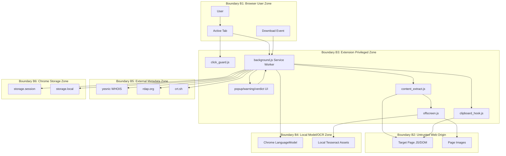
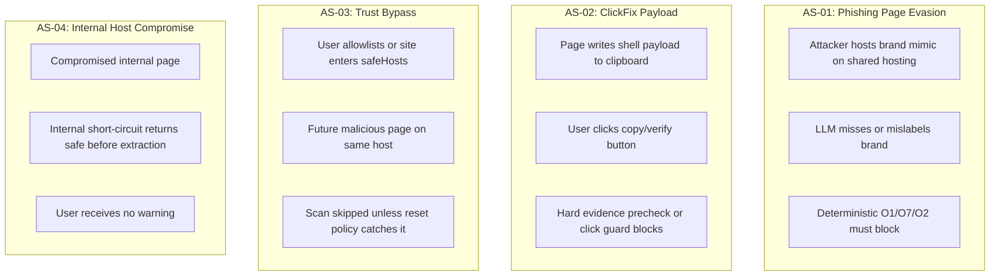

# ScamGuard AI Security Architecture Review

Date: 2026-05-28  
Scope target: Chrome MV3 extension in this repository  
Analysis basis: code-only static review; no runtime/browser verification in this pass  
Primary spec: `docs/development-spec.md`

## 1. Scope And Dependencies

ScamGuard AI is a local Chrome extension that detects phishing pages using Chrome built-in Gemini Nano plus deterministic browser-side signals. Runtime dependencies and integrations:

| Component | Role | Evidence |
|---|---|---|
| Chrome MV3 APIs | tabs, scripting, storage, notifications, offscreen, downloads, bookmarks/history/topSites | `manifest.json:15` |
| Gemini Nano `LanguageModel` | local verdict generation | `background.js:258`, `background.js:296` |
| Tesseract.js local assets | OCR for page images | `offscreen.js:8`, `offscreen.js:43` |
| yesnic | WHOIS HTML source | `background.js:509` |
| rdap.org | registrant ownership metadata | `background.js:527` |
| crt.sh | CT issuer org metadata | `background.js:570` |
| Target web pages | DOM, images, links, clipboard/download behavior | `content_extract.js:209` |

## 2. Attack Surface Inventory

| Surface | Inputs | Outputs | Auth/Trust | Risk Notes |
|---|---|---|---|---|
| Runtime message `scan` | URL, source, tab id, bypass flag | verdict/error | Any extension page/content script | Main control-plane API. Source controls side effects. |
| Runtime messages `allowlist`, `resetHistory*`, `getVerdict` | URL or verdict id | storage mutation/result | Extension UI/content context | User-control APIs; sender identity is extension context. |
| Content script click listener | Page DOM clicks | blocked click, confirm, scan request | Runs on all http/https | Page DOM can influence classification and UI text. |
| Hidden scan tab | Arbitrary URL | extracted DOM/behaviors | Untrusted web origin | Executes attacker JS in an inactive tab. |
| Offscreen OCR/static parse | image blobs, HTML, messages | text/parsed data/icons | Extension origin | Image fetches can contact target origins. |
| Downloads listener | Chrome download metadata | cancel/erase/resume | Browser download event | Race possible for small files. |
| External metadata lookups | domain/host | WHOIS/RDAP/CT strings | Third-party services | Leaks queried domains to those services. |
| Local/session storage | verdicts, allowlist, denylist, lang, icons | cache decisions | Extension storage | Verdict reasons may include truncated payload snippets. |

## 3. DFD Summary

Normal flow: user action or browser event reaches `background.js`, cache/trust checks short-circuit where possible, page evidence is extracted, hard-evidence precheck may return a verdict before LLM, otherwise Gemini Nano produces schema-bound JSON, deterministic overrides adjust the verdict, then UI/storage/download side effects apply.

Trust boundaries:

| Boundary | Includes | Trust Level |
|---|---|---|
| B1 Browser user zone | User, active tab, clicked links, downloads | Untrusted user/page interaction |
| B2 Web origin zone | Arbitrary target pages/images/scripts | Untrusted |
| B3 Extension privileged zone | service worker, extension pages, content/offscreen scripts | Privileged local code |
| B4 Local model/OCR zone | Gemini Nano, local Tesseract files | Local dependency |
| B5 External metadata zone | yesnic, rdap.org, crt.sh | Third-party metadata services |
| B6 Chrome storage zone | local/session extension storage | Persistent/session trusted state |

## 4. Sensitive Data Map

| Data | Source | Processing | Storage |
|---|---|---|---|
| URL/host | User navigation/click/download | scan key, WHOIS/RDAP/CT, prompt | session verdict cache; allowlist host in local |
| DOM text/forms/links | Target page | prompt slices, hard evidence | not directly persisted except verdict reason |
| Clipboard write payloads | Target page JS via hook/static literals | shell payload detection | may be truncated into verdict reason |
| OCR text | Target images | prompt slice | not directly persisted |
| Browser history/bookmarks/topSites domains | Chrome APIs | O5 personal trust set | memory cache only |
| Denylist host | final phishing host | sha256 hash | `chrome.storage.local.phishingDenylist` |
| Allowlist host | user approved host | short-circuit | `chrome.storage.local.allowlistHosts` plaintext |
| Language preference | user selection | UI rendering | `chrome.storage.local.lang` |

## 5. Trust Boundaries And Controls

| Boundary Crossing | Control |
|---|---|
| Web page to content script | Isolated world for `click_guard.js`; MAIN world hook only records clipboard writes into bounded dataset |
| Hidden tab to extension | `#__pg_scan=1` marker prevents recursive click-guard scan; tab removed in `finally` |
| Untrusted DOM to LLM | prompt slice caps, schema-constrained output, deterministic overrides |
| LLM output to user action | danger/warn thresholds and warning-page intercept |
| External metadata to safe override | Intended independent ownership evidence from RDAP/CT; shared-hosting guards |
| User allowlist to scan bypass | host-level local allowlist; reset-all clears it |
| Denylist to persistent blocking | host hash only; private IP excluded |

## 6. Risk Summary

| ID | Risk | Severity | Notes |
|---|---|---|---|
| R-001 | Hidden tab executes attacker JS during scan | High | Mitigated by timeout/removal, but attacker code still runs in browser context. |
| R-002 | Broad permissions increase blast radius | High | `<all_urls>`, downloads, history/bookmarks/topSites require strong review for distribution. |
| R-003 | Domain metadata leaks to third parties | Medium | yesnic/RDAP/CT receive queried domains; product privacy wording must be precise. |
| R-004 | Persistent allowlist can suppress future warnings for a host | Medium | UX confirms, but user error can create blind spot. |
| R-005 | Verdict reason may contain truncated malicious command text | Medium | Useful for explainability, but avoid exposing secrets if future extraction captures them. |
| R-006 | Internal-domain safe short-circuit can miss compromised intranet pages | Medium | Current policy intentionally trusts internal/private hosts before extraction. This is accepted by SPR-001 but remains residual risk. |
| R-007 | Download pause/cancel is best-effort | Medium | Tiny files may complete before scan finishes. |
| R-008 | O1-whois ownership matching can regress if broadened beyond independent evidence | Low | Current code restricts matching to `Registrant:` and `IssuerOrg:` segments; keep regression coverage for hallucinated/short brand tokens. |

## 7. DFD Mermaid

## 8. Attack Flow Mermaid

## 9. Attack Scenarios

| Scenario | Normal DFD Flow | Abuse Path | Confirmation Needs |
|---|---|---|---|
| AS-01 Brand mimic on shared hosting | User -> SW -> extraction -> LLM -> overrides -> warning | Attacker uses workers.dev/pages.dev and brand UI to trick user; O1/O7 must override weak LLM output | Fixture coverage for each high-value brand |
| AS-02 ClickFix shell payload | ClickGuard/hidden tab captures clipboard and code snippets | User is instructed to paste command into shell | Ensure payload is never long-term stored beyond bounded reason |
| AS-03 Allowlist/safeHosts bypass | Safe verdict creates host trust; allowlist creates local bypass | User or rule trusts a host that later serves malicious content | Audit reset UX and shared-hosting guards |
| AS-04 Internal host phishing | Internal URL reaches `scanUrl` and returns safe before extraction | Compromised intranet page with credential form/ClickFix is skipped | Policy decision recorded in SPR-001; re-open if internal compromise detection becomes in-scope |
| AS-05 Download race | downloads listener pauses and scans page | Small executable completes before pause/cancel | Runtime timing tests with small files |

## 10. Confidence & Gaps

Confidence is medium-high for static architecture because the main flows are centralized in `background.js`. Runtime behavior for Gemini Nano availability, Chrome downloads race timing, and actual warning-page intercept was not verified in this pass.

Gaps:

| Gap | Status |
|---|---|
| OWA auto-scan is code-present but manifest-disabled | Confirmed in code/docs |
| Internal-domain hard-evidence policy | Decision recorded: internal/private hosts are unconditionally trusted before extraction (SPR-001 done); residual risk remains |
| External metadata privacy wording | Confirmed design wording gap |
| Broad permission minimization | Needs product/distribution decision |

## 11. Security Product Requirements Backlog Summary

Detailed backlog is maintained in `security-product-requirements.md`. Highest priority items are:

| Requirement | Priority |
|---|---|
| SPR-001 internal-domain dangerous-signal policy | P0, done |
| SPR-002 define precise privacy wording for Zero-Data | P1 |
| SPR-003 add permission justification and minimization review | P1 |
| SPR-004 prevent sensitive values from entering long-lived verdict text | P1 |

## 12. Safe-Sharing Notes

Do not publish raw phishing URLs, clipboard payloads, internal domains, or verdict JSON that may contain user-specific page text without review. This repository also contains legacy files that prior docs identify as having historical hardcoded credentials; do not use them as examples in external material.
